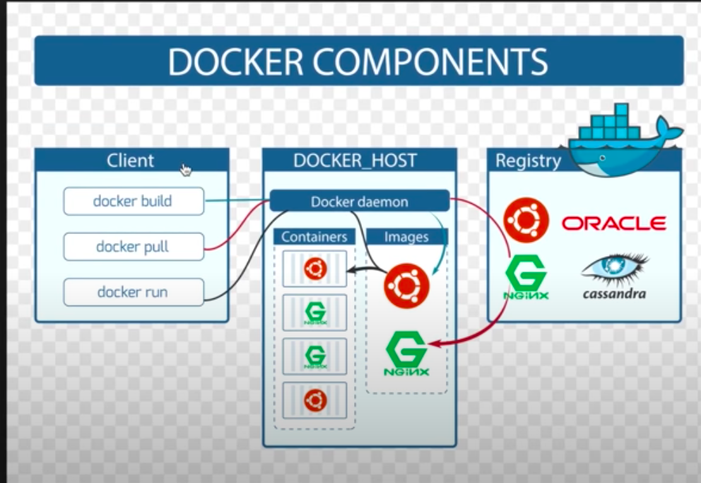

 

# What are Containers?
Running instances of images.

**Features**
1. Very light weight (less resources are used)
2. Booting of container is very fase
3. can easily, start, stop and kill a container.

## COMMANDS

1. 
```bash
docker run --name MyUbuntu1 -it ubuntu
```
**Usage** - will run a image and give it name as well.

2.
```bash
docker pause MyUbuntu1
```
(docker pause <Container Id | name>)

**Usage** - It will basically pause the container. (Even if you type something, it wont show)

```bash
docker unpause MyUbuntu1
```
**Usage** - It will run all the commands which were executed after the container was stopped.

3. 
```bash
docker top <container name | id>
```
**Usage** - Display the running processes of a container.

4.
```bash
docker stats <container name | id>
```
**Usage** - Will display a live stream of container resource usage stats.

5.
```bash
docker attach <container name | id>
```
**Usage** - will attach to a running container. (if you exit, all the other terminals where this container is being run will also be exited).

can be used in this way as well
```bash
docker start MyUbuntu1
docker attach MyUbuntu1
```

or 
```bash
docker start RahulUbuntu -i
```

6.
```bash
docker kill RahulUbuntu
```
**Usage** - Kill one or more running containers.

7.
```bash
docker rm MyUbuntu1
```
**Usage** - Remove a container. (add -f to remove a running container)

8.
```bash
docker history ubuntu
```
**Usage** - Will show history of the image